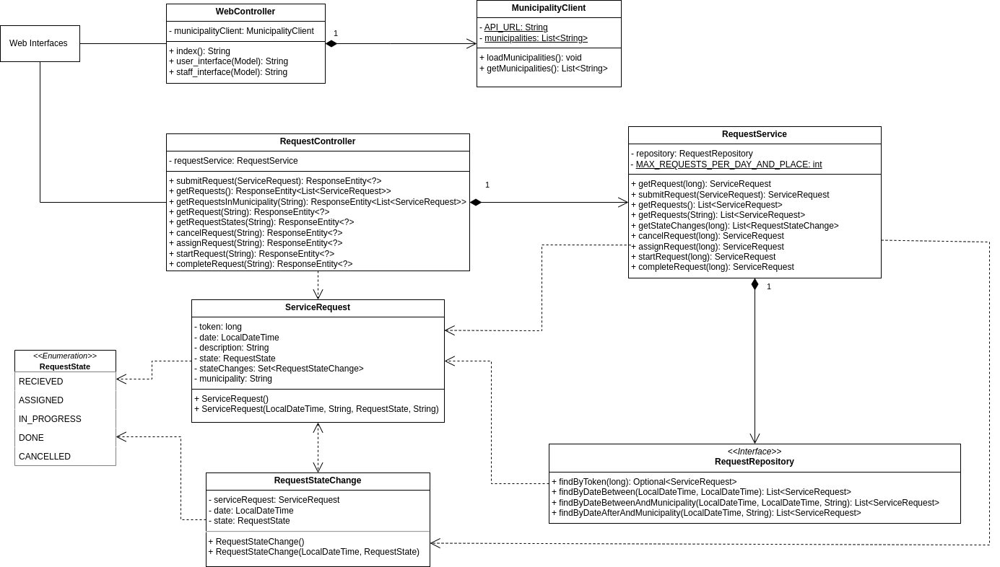
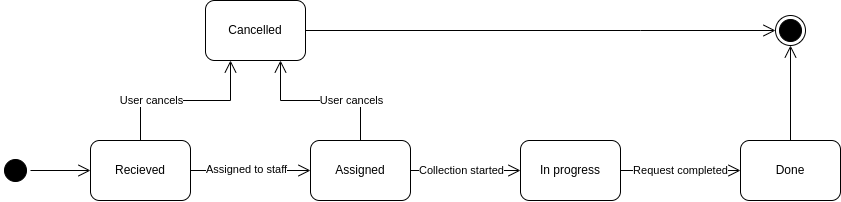
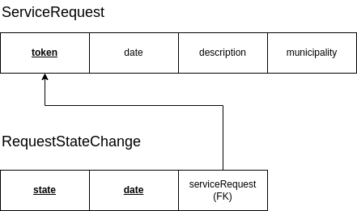

# ZeroMonos

ZeroMonos is a full-stack application for handling the booking and collection of bulky waste items such as big appliances and matresses.
It has a web interface as well as a robust REST API on the backend for the business logic and operations.

It was developed as an assignment for my Software Tests and Quality course.

## Project structure

```
ZeroMonos
├── docs ------------------------------------------------------ # Diagrams and other reports
│   ├── Architecture-diagram.png
│   ├── ER.png
│   ├── MainPageLighthouse.png
│   ├── Request-state-diagram.png
│   ├── StaffPageLighthouse.png
│   ├── TQS-assignment-template.pdf
│   ├── UserPageLighthouse.png
│   └── Video.mkv
├── LICENSE
├── pom.xml
├── README.md
└── src
    ├── main
    │   ├── java/pt/ua/tqs/hw1
    │   │   ├── boundary -------------------------------------- # Controllers
    │   │   │   ├── RequestController.java
    │   │   │   └── WebController.java
    │   │   ├── data ------------------------------------------ # Database entities
    │   │   │   ├── RequestRepository.java
    │   │   │   ├── RequestStateChangeId.java
    │   │   │   ├── RequestStateChange.java
    │   │   │   ├── RequestState.java
    │   │   │   └── ServiceRequest.java
    │   │   ├── service --------------------------------------- # Business logic
    │   │   │   ├── InvalidRequestDateException.java
    │   │   │   ├── InvalidStateTransitionException.java
    │   │   │   ├── MunicipalityClient.java
    │   │   │   ├── RequestNotFoundException.java
    │   │   │   ├── RequestOverflowException.java
    │   │   │   └── RequestService.java
    │   │   └── Hw1Application.java
    │   └── resources
    │       ├── application.properties
    │       ├── static/css
    │       │   └── style.css
    │       └── templates ------------------------------------- # Thymeleaf templates
    │           ├── index.html
    │           ├── staff_interface.html
    │           └── user_interface.html
    └── test
        └── java/pt/ua/tqs/hw1
            ├── endtoend -------------------------------------- # End to end tests
            │   ├── StaffTest.java
            │   └── UserTest.java
            ├── integration ----------------------------------- # Integration tests
            │   ├── MunicipalityClientIT.java
            │   └── RequestControllerIT.java
            └── unit ------------------------------------------ # Unit tests
                ├── BookingTest.java
                ├── MunicipalityClientTest.java
                ├── RequestControllerTest.java
                ├── RequestServiceGettersTest.java
                ├── StateTransitionTest.java
                └── WebControllerTest.java
```

## Diagrams

### Architecture

The system follows a layered architecture with separation of concerns.



### State diagram for a request



### Relational Schema



## Tech stack

- **Database**: H2 database + JPA/Hibernate
- **Backend**: Java 21 + Spring Boot
- **Frontend**: HTML (Thymeleaf templates)
- **Testing**: JUnit5 + REST-Assured + Selenium
- **Coverage and static analysis**: JaCoCo and SonarCloud
- **API Docs**: OpenAPI (Swagger UI)
- **Build**: Maven
- **CI**: GitHub Actions

## Run

**Maven** is the only dependency needed.
```
mvn spring-boot:run
```
The app will be available at http://localhost:8080

Swagger OpenAPI UI: http://localhost:8080/swagger-ui.html

OpenAPI JSON: http://localhost:8080/v3/api-docs
